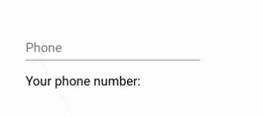

# mui-phone-input

This is a simple wrapper around material-ui's `<TextField>` component. This wrapper handles the input as a phone number. It only allows numbers, and dashes are automatically inserted and removed while typing.

Here is what the input looks like while typing:



# Install

```bash
npm i mui-phone-input
# or
yarn add mui-phone-input
```

# Usage with React

All properties available to [material-ui's `<TextField>`](https://material-ui.com/api/text-field/) are available to `<PhoneInput>`.

Here is a minimal example of using the input:

```jsx
import React from 'react';
import PhoneInput from 'mui-phone-input';

function App() {
  const [value, setValue] = React.useState('');
  return (
    <div>
      <PhoneInput onChange={setValue} />
      <p>Your phone number is {value}</p>
    </div>
  );
}
```

### Notes:

- 90% of the time, you won't need to use two-way data binding. This is due to the fact that this input formats everything for you.
- However, two-way data binding is still available.
